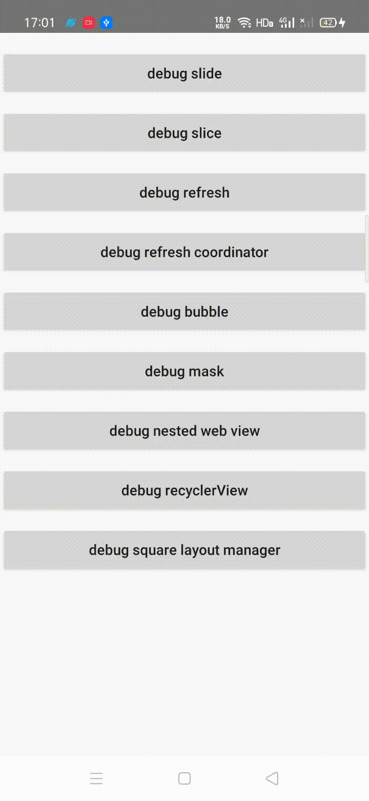

# SquareLayoutManager
### 效果图



### 基本使用

```kotlin
// 设置 RecyclerView 的 layoutManager
// 构造函数参数 spanCount为一行有多少个 ItemView，startPosition 为其实位置（不传默认中间）
rvSquare.layoutManager = SquareLayoutManager(20, 10)
```

### 可使用方法

```kotlin
// 滑动到指定位置，可在监听 itemView 的点击事件，进行移动操作
layoutManager.smoothScrollToPosition(position) 

// 手动滑动过程中，是否自动让靠近中心的 view 居中，类似 LinearSnapHelper 效果，使用 fling 实现
// 默认为true
layoutManager.isAutoSelect = true

// 初始化布局的时候，是否是定位到中心的 item
// 默认为true
layoutManager.isInitLayoutCenter = true

// 选中监听
layoutManager.setOnItemSelectedListener { postion ->
    Toast.makeText(context, "当前选中：$postion", Toast.LENGTH_SHORT).show()
}

// 滑动到中心
layoutManager.smoothScrollToCenter()
```

